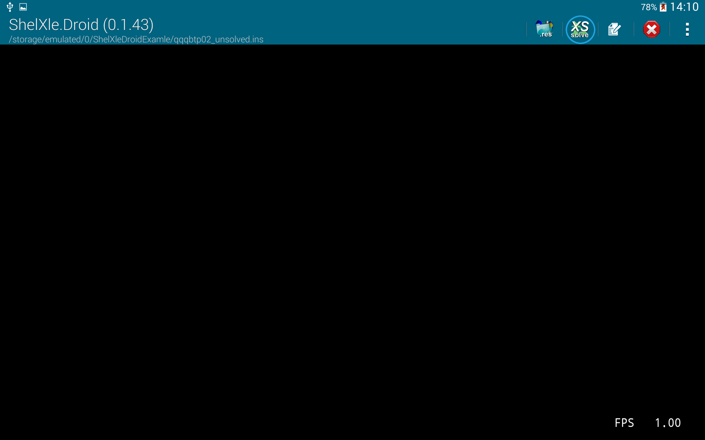
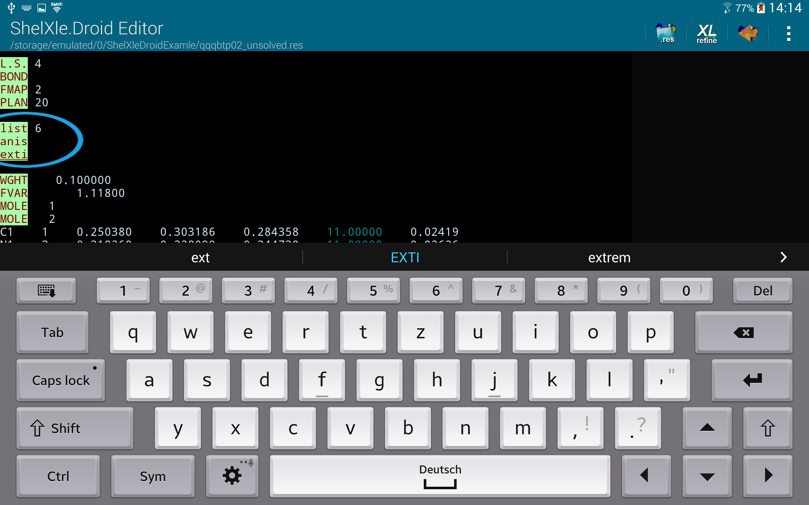

# ShelXleDroid
This is a small app that lets you view, edit, solve and refine your SHELX structures on your Android Device

## Abstract
ShelXle.Droid is an Android Version of ShelXle a cute GUI for SHELXL.
ShelXle.Droid renders molecular structures in shelx.res or .ins files.
Refines structures using shelxl97.
Shows Fourier-Maps if fcf file in LIST 6 format is present.
A simple editor allows editing of res files.
Simple re-labelling can be done if continuous rotation is switched off.
HFIX adds some hydrogen atoms.

This App is intended for users that are familiar with single-crystal-X-ray-structure refinement with SHELXL.

## Demo Video

## How to use

